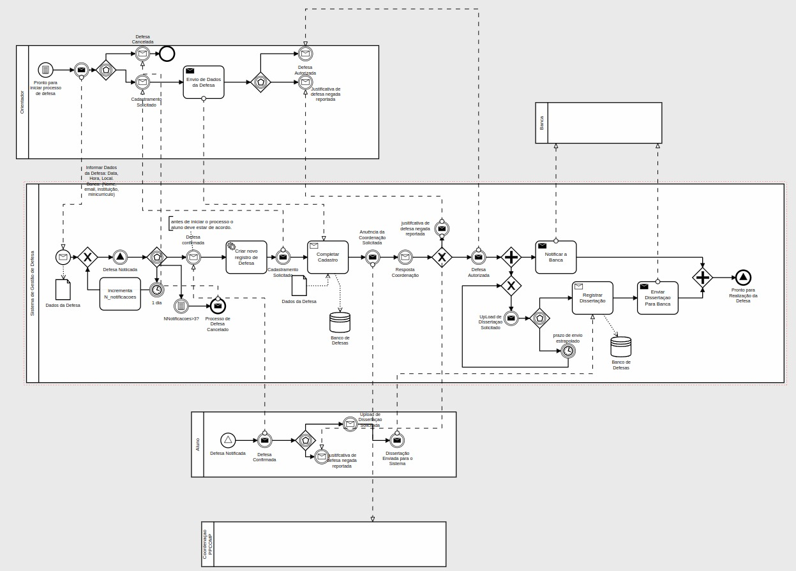
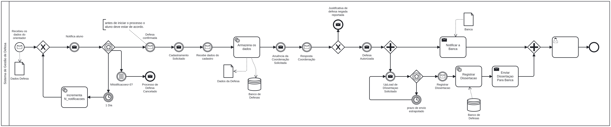
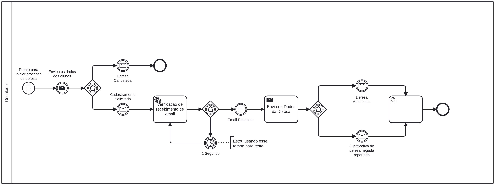
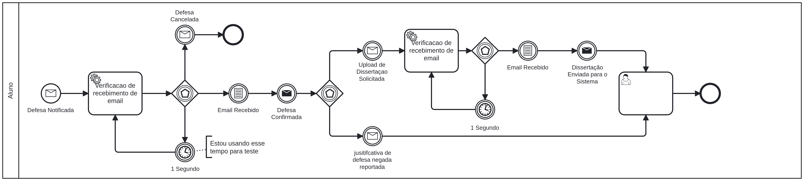
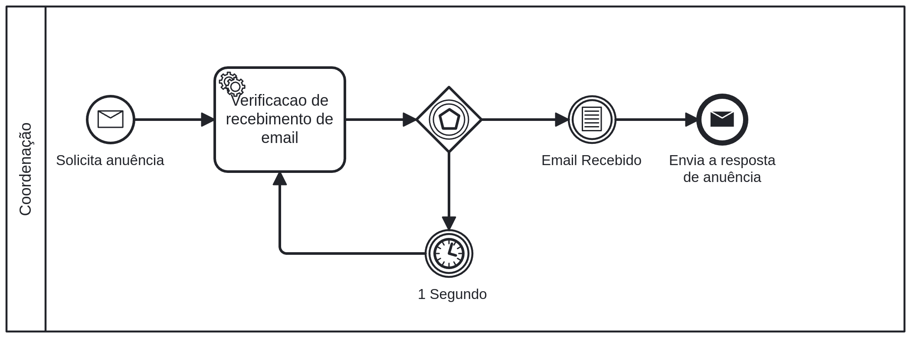

# Sistema de Controle de Defesa
> *Este sistema é responsável pelo controle das defesas, gerenciando e monitorando e-mails e documentos, garantindo a integridade e a organização das informações. A plataforma foi desenvolvida para apoiar a gestão de dados e otimizar o controle da comunicação interna.*

## 📄 Descrição
- **O que o sistema faz?**

  - Esse sistema é responsável por controlar toda a gestão de dados do mestrado, desde a coleta inicial até a data final da defesa do aluno.

- **Quem são os usuários alvo?**

  - Os usuários alvo deste projeto são coordenadores de curso, orientadores, membros da comissão e alunos. 

- **Principais funcionalidades?**
  - Envio e recebimento de e-mails;
  - Armazenamento de dados no banco de dados;
  - Análise de processos via BPMN;
  - Comunicação entre todos os envolvidos;

## 🚀 Tecnologias Utilizadas
- **Linguagem de programação**
  - Java - 17
    
- **Frameworks**
  - Spring Boot - 3.3.3
  - Camunda BPM - 7.22.0

- **Bibliotecas**
  - PostgreSQL
  - H2 Database
  - Spring JDBC
  - JavaMail API
  - Java Activation

## ⚙️ Instalação e Execução 

[GitHub do projeto](https://github.com/Davidsonnj/Defesa-Mestrado-BPMN)

#### ✅ Pré-requisitos
*Antes de começar, verifique se você tem instalado:*

- *Java 17 ou superior*
- *Maven 3.8+*
- *Git (para clonar o repositório)*
- *PostgreSQL (se for rodar com banco de dados local)*
  
### 📥 Como clonar o projeto

```bash
git clone https://github.com/Davidsonnj/Defesa-Mestrado-BPMN.git
```

Antes de tudo entre no path:

```bash
cd Defesa-Mestrado-BPMN/Defesa-Mestrado-Camunda/defesa-mestrado/
```

### 📦 Como instalar as dependências
O Maven irá gerenciar todas as dependências automaticamente. Basta rodar:

```bash
mvn clean install
```
### 🎯 Como rodar o servidor localmente

```bash
mvn spring-boot:run
```
*A aplicação estará disponível em:* http://localhost:8080

## 🗂️ Organização do Código

<pre> Defesa-Mestrado-BPMN/
└── Defesa-Mestrado-Camunda/
    ├── anexos/
    ├── defesa-mestrado/
    │   ├── camunda-h2-database.mv.db
    │   ├── Defesa-Mestrado.png
    │   ├── pom.xml
    │   ├── src/
    │   │   └── main/
    │   │       ├── java/
    │   │       │   └── br/
    │   │       │       └── edu/
    │   │       │           └── ifes/
    │   │       │               └── mestrado/
    │   │       │                   ├── Application.java
    │   │       │                   ├── camunda/
    │   │       │                   │   ├── controller/
    │   │       │                   │   │   └── delegates/
    │   │       │                   │   │       ├── Aluno/
    │   │       │                   │   │       ├── coordenacao/
    │   │       │                   │   │       ├── Orientador/
    │   │       │                   │   │       └── SistemaPrincipal/
    │   │       │                   │   ├── dao/
    │   │       │                   │   │   ├── implementations/
    │   │       │                   │   │   └── interfaceDAO/
    │   │       │                   │   ├── exception/
    │   │       │                   │   └── model/
    │   │       │                   ├── database/
    │   │       │                   └── emailAPI/
    │   │       │                       ├── controller/
    │   │       │                       ├── model/
    │   │       │                       ├── service/
    │   │       │                       └── view/
    │   │       └── resources/
    │   └── target/
    └── docs/
        └── defesa/
            ├── BPMNs/
            ├────images/
            └── diagram_relacional/</pre>

## 💾 Diagrama Relacional

O diagrama abaixo representa visualmente as informações relacionadas à **Defesa de Mestrado**, incluindo os dados de alunos, bancas e defesas. Ele facilita o entendimento das relações entre as tabelas no banco de dados do sistema.

.png)

## 📊 Diagramas BPMN (Business Process Model and Notation)

Os diagramas a seguir representam visualmente os processos relacionados à Defesa de Mestrado, modelados segundo a notação BPMN (Business Process Model and Notation). Essa notação permite uma compreensão clara e padronizada do fluxo de atividades entre os envolvidos no processo.
> Este é o diagrama base, que representa a visão geral de todo o processo de defesa. A partir dele, foram derivados outros diagramas mais específicos que detalham subprocessos individuais (como aluno, orientador, coordenação, etc.).


### 🖥️ Sistema de Mestrado
> Representa as responsabilidades automatizadas e operacionais atribuídas ao sistema no decorrer da defesa, como envio de e-mails, controle de prazos e armazenamento de informações.


### 👨‍🏫 Orientador
> Descreve o fluxo de ações atribuídas ao orientador do aluno, como validação de documentos, acompanhamento do progresso do orientando e aprovação das etapas do processo.


### 🎓 Aluno
> Exibe as responsabilidades do aluno, incluindo a entrega de documentos e confirmação da defesa.


### 📚 Coordenação
> Apresenta as etapas sob responsabilidade da coordenação, como confirmar ou negar anuência da defesa.

